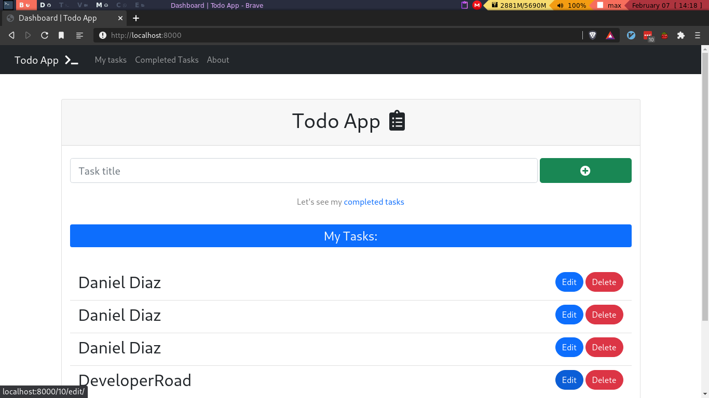
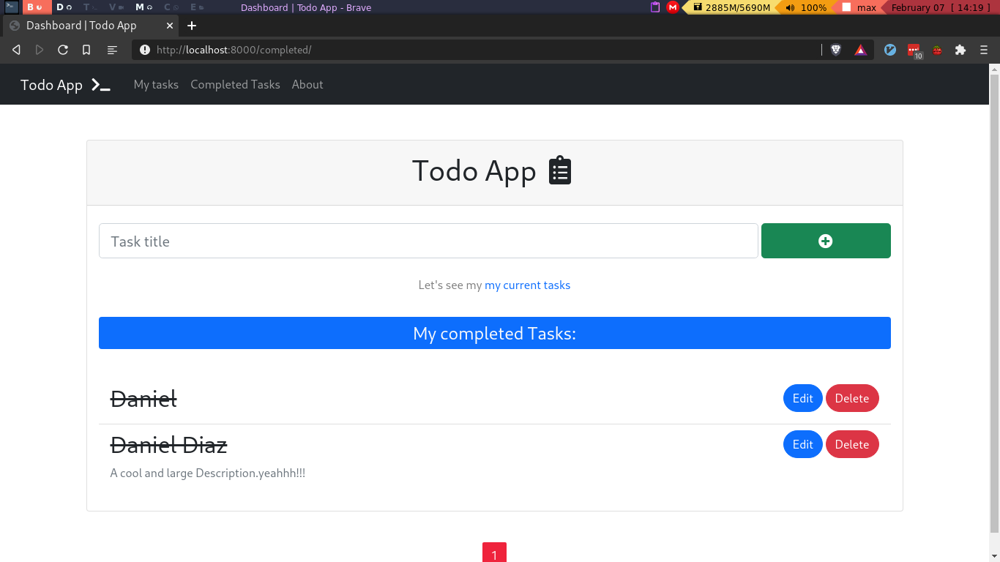

# Django To do App

This is an Django Todo App with `CRUD` functionality where you can manage your tasks.

*All tasks*

*Completed Tasks*

This is a simple Django App, but I'll create a React app with Django backend in top of this simple app, [here](https://github.com/Daniel1404/Todo-app-in-Django-React)

## Todo's
- [ ] Publish Blog posts about this
- [ ] Create the API
- [ ] Create a React App
- [ ] Publish it on Heroku.

