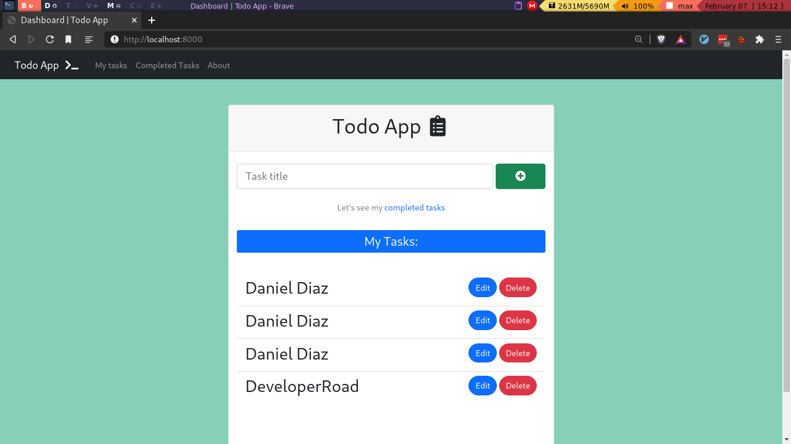

# Django To do App

This is an Django Todo App with `CRUD` functionality where you can manage your tasks.


*All tasks*


*Completed Tasks*

This is a simple Django App, but I'll create a React app with Django backend in top of this simple app, [here](https://github.com/Daniel1404/Todo-app-in-Django-React)

## Contributing | Using

### Setup

Install the requirements, in `requirements.txt` file in the root directory.

```bash
pip install -r requirements.txt
```

Then just run the development server.

```bash
python manage.py runserver
```

Finally open it on [localhost](https://localhost:8000/)


## Todo's
- [ ] Publish Blog posts about this
- [ ] Create the API
- [ ] Create a React App
- [ ] Publish it on Heroku.

